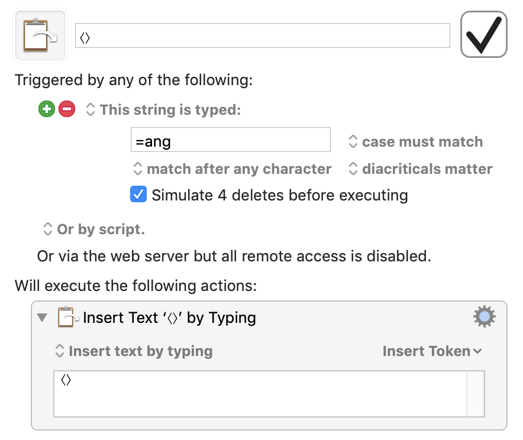

# My Keyboard Maestro macros

[Keyboard Maestro](https://www.keyboardmaestro.com) is an app for macOS that allows the execution of simple programs of keyboard and mouse actions through various triggers.

This repo contains and briefly describes my macros, many of which I use daily.

## Abbreviations

In this group every macro is triggered by typing a string, when they delete the number of characters typed, and insert some text “by typing”. While most of them can match after any character (e.g. `=ang` to produce angular brackets), some only trigger when typed after a word break (such as `Dj` for producing “Daily journal”).

Example:

 - `---` produces “------------------”
 - `=ang` produces “⟨⟩”
 - `=*` produces “•”
 - `=shrugs` produces `¯\_(ツ)_/¯`
 - `=->` produces “→”
 - `==>` produces “⇒”
 - `=forall` produces “∀”
 - `=exist` produces “∃”
 - `=nabla` produces “∇”
 - `=in ` produces “∈ ”
 - `=pm` produces “±”
 - `=neq` produces “≠”
 - `===` produces “=====================”
 - `=not` produces “¬”
 - `=prop` produces “∝”
 - `=inf` produces “∞”
 - `=sim` produces “∼”
 - `=app` produces “≈”
 - `=equiv` produces “≡”
 - `=leq` produces “≤”
 - `=geq` produces “≥”
 - `=sub` produces “⊆”
 - `=done` produces “✓”
 - `=<3` produces “🖤”
 - `=Dj` produces “Daily journal”
 - `=Dp` produces “Daily plan”
 - `=leq` produces “≤”
 - `=lorem` produces 200 words of [Lorem ipsum](https://en.wikipedia.org/wiki/Lorem_ipsum)
 - `=uktel` produces my UK phone number
 - `=uun` produces “s1765864”
 - `=al` produces “α”
 - `=be` produces “β”
 - `=gam` produces “γ”
 - `=Gam` produces “Γ”
 - `=del` produces “δ”
 - `=Del` produces “Δ”
 - `=eps` produces “ε”
 - `=zeta` produces “ζ”
 - `=eta` produces “η”
 - `=the` produces “θ”
 - `=The` produces “Θ”
 - `=iota` produces “ι”
 - `=kap` produces “κ”
 - `=lam` produces “λ”
 - `=mu` produces “μ”
 - `=nu` produces “ν”
 - `=xi` produces “ξ”
 - `=Xi` produces “Ξ”
 - `=pi` produces “π”
 - `=Pi` produces “Π”
 - `=rho` produces “ρ”
 - `=sig` produces “σ”
 - `=Sig` produces “Σ”
 - `=tau` produces “τ”
 - `=ups` produces “υ”
 - `=phi` produces “φ”
 - `=Phi` produces “Φ”
 - `=chi` produces “χ”
 - `=psi` produces “ψ”
 - `=Psi` produces “Ψ”
 - `=om` produces “ω”
 - `=Om` produces “Ω”

## Clipboards

Macros for handling clipboard history.

 - ⌥⌘V pops an item from the clipboard history. (Paste and delete last).
 - ⌥⌘⌫ discards the last item from the clipboard history.
 - ⌃⌥⌘V activates the Keyboard Maestro clipboard history switcher. Convenient for picking an image or rich formatted clipboard history item.

In addition:
 - the Mac built-in ⇧⌥⌘V pastes without formatting,
 - ⇧⌥⌘V shows the clipboard history of the very eye-pleasing [Clipy app](TODO).

## Keyboard Combos

 - ⌥2 pastes stylized quotations marks (“”) and puts the cursor in the middle.
 - ⌥3 types “#”
 - ⌥4 types “$$”. Handy for inserting Latex in Markdown.
 - ⌥5 types a degree symbol “°”
 - ⌥6 types “^”.
 - ⌥9 opens a user prompt and saves the value into a day-indexed file, for microjournaling.
 - ⌥A types “ä”.
 - ⌥B types “\mathbf{}”
 - ⌥D types the current date, e.g. “2019-02-05”.
 - ⌥E types “€”.
 - ⌥F types “laszlo.treszkai@gmail.com”.
 - ⌥L types “£”.
 - ⌥M types an em-dash (—).
 - ⌥N types an en-dash (–).
 - ⌥P appends a timestamp to a fixed file. Useful for counting or tracking a certain event.
 - ⌥T types the time, in format “@time(20:46)”, convenient for my journal.
 - ⌥U has the computer say [“Tsuyoku naritai!”](), meaning “I want to become stronger” in Japanese.
 - ⌥W has the computer say “Szép munka!”, meaning “Well done” in Hungarian.

**And my favorites**, the reason why I bought KM:
 - ⇧⌫ deletes a character forward (originally Fn + ⌫).
 - ⇧⌥⌫ deletes a word forward (originally Fn + ⌥ + ⌫).

This way I can delete from the right without my pinky awkwardly on the bottom-left of the keyboard.

## Global Macro Group

This is a miscellaneous collection of remappings, mainly for turning the Fn keys into media buttons on an external keyboard.

 - F3: Exposè.
 - F4: Application Switcher.
 - F6: Open Finder in `~/Documents/`.
 - F7: Previous song in Spotify. (Activate Spotify, type ⌘←, hide front application.) Good for music control on a Windows keyboard.
 - F8: Play/pause in Spotify.
 - F9: Next song in Spotify.
 - F10: Mute toggle. (This is the real system mute.)
 - F11: Volume down.
 - F12: Volume up.

 - Every 30 minutes: Open a system notification, asking me, “What are you doing right now?” This serves a reminder to press ⌥9 and save my current activity as a form of microjournaling.

# Other collections

These collections on the KM forum also look interesting:
 - [Best Examples of Keyboard Maestro Macros](https://forum.keyboardmaestro.com/t/best-examples-of-keyboard-maestro-macros/2817)
 - [Best Macro List](https://forum.keyboardmaestro.com/t/best-macro-list/4118)
